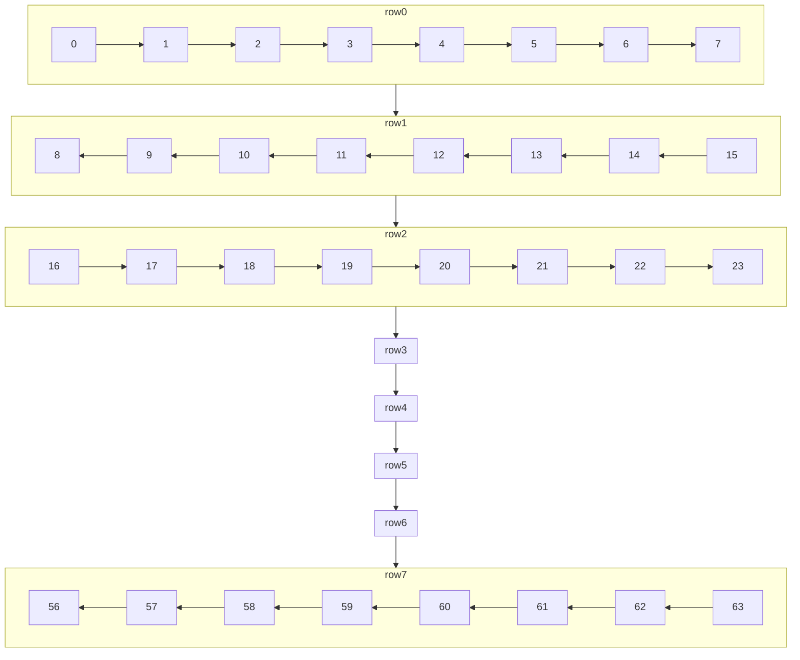

# ws2812 driver
# main function
* support show single char(lcd1602 encoding)
* support scroll message(lcd1602 encoding)

# hardware config
* 32M crystal oscillator(may be reduced to 16M, but code need to be modified for the macro WRITE0&WRITE1)
* make sure the power supply is enough, or the mcu will restart abnormally.
* 8x8 ws2812 zig-zag cascading

